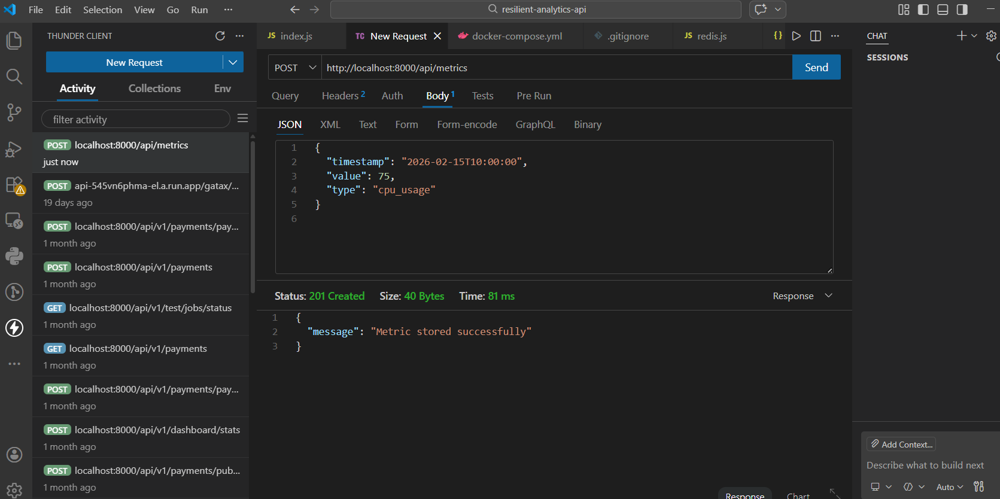
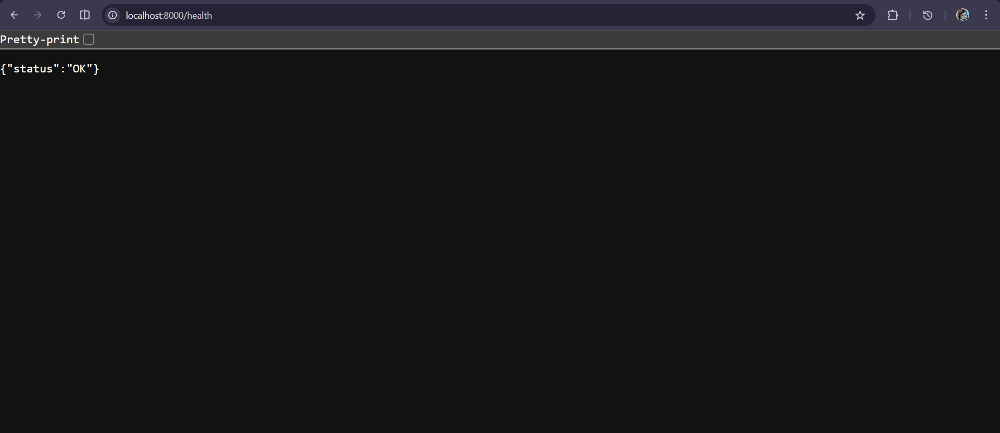

#  Resilient Analytics API

A production-style backend API built with **Node.js + Express**, implementing advanced resilience patterns including:

-  Redis-based Caching
-  Rate Limiting (Redis-backed)
-  Circuit Breaker Pattern
-  Full Docker Containerization
-  Health Checks for all services

> A resilient backend service demonstrating caching, rate limiting, and circuit breaker patterns using Redis and Docker.

This project simulates a real-time analytics backend capable of handling high traffic and external system failures gracefully.

---

##  Architecture Overview

The system consists of:

- **Node.js API Service**
- **Redis Service (Dockerized)**
- Docker Compose orchestration
- Health checks for service readiness

```text
Client → Express API → Redis (Cache + Rate Limit)
↓
Circuit Breaker
↓
Simulated External Service
```


---

## Features Implemented

### Metrics Ingestion API

### Metrics Ingestion (POST Success)


**POST /api/metrics**

Stores analytics metrics.

**Request Body**
```json
{
  "timestamp": "2026-02-15T10:00:00",
  "value": 75,
  "type": "cpu_usage"
}
```
### Response
```bash
201 Created
```
## Metrics Summary with Redis Caching

### Metrics Summary (GET Success)


The above screenshot shows the first API call, so the count is 1.

GET /api/metrics/summary?type=cpu_usage

- Uses Redis read-through caching

- TTL: 60 seconds

- Returns cached result if available

- Recomputes if cache expired

Example Response
```json
{
  "type": "cpu_usage",
  "count": 2,
  "average_value": 80
}
```

## Rate Limiting (Redis-backed)

Applied to:
```bash
POST /api/metrics
```

- Limit: 5 requests per minute per IP

- Uses Redis INCR + EXPIRE

- Returns:

```makefile
429 Too Many Requests
Retry-After: <seconds>
```

## Circuit Breaker Pattern
```bash
Endpoint:

GET /api/external-data
```
###  Circuit Breaker – OPEN State (Fail Fast)


Implements:

- CLOSED → Normal operation

- OPEN → Fail fast after 3 failures

- HALF-OPEN → Test request after 30 seconds

- Returns fallback response when OPEN.

Example:
```json
{
  "circuit_state": "OPEN",
  "message": "Fallback response: External service unavailable"
}
```

## Docker Setup
## Build & Run
```bash
docker compose up --build
```
## Access
```bash
http://localhost:8000/health
```
### health


## Stop
```bash
docker compose down
```

## Testing the System
### Test Caching

- Call summary once → computes and caches

- Call again → served from Redis

## Test Rate Limiting

Send 6 POST requests quickly.

6th request returns:
```text
429 Too Many Requests
```

### Rate Limiting – 429 Response


## Test Circuit Breaker

Call repeatedly:
```bash
GET /api/external-data
```

### Circuit Breaker – CLOSED After Recovery


 After 3 failures:

- Circuit transitions to OPEN

- Returns fallback

- After 30 seconds → HALF-OPEN test

- Success → CLOSED

## Health Checks

Both services include Docker health checks.

Verify:
```bash
docker ps
```

You should see (healthy) status.

## Tech Stack

- Node.js

- Express.js

- Redis

- Docker

- Docker Compose

## Why This Project Matters

This project demonstrates:

- Production-ready API design

- Fault tolerance engineering

- Resilience patterns used in distributed systems

- Dockerized microservice architecture

- System reliability thinking

These patterns are widely used in:

- SaaS platforms

- E-commerce systems

- Cloud-native applications

- High-traffic APIs

## Configuration

Environment variables used:

- PORT=8000
- REDIS_URL=redis://redis:6379
- RATE_LIMIT_WINDOW=60
- RATE_LIMIT_MAX=5
- CIRCUIT_FAILURE_THRESHOLD=3
- CIRCUIT_RESET_TIMEOUT=30


## Author

Ashrita Gogula
Backend Developer | Cloud Enthusiast